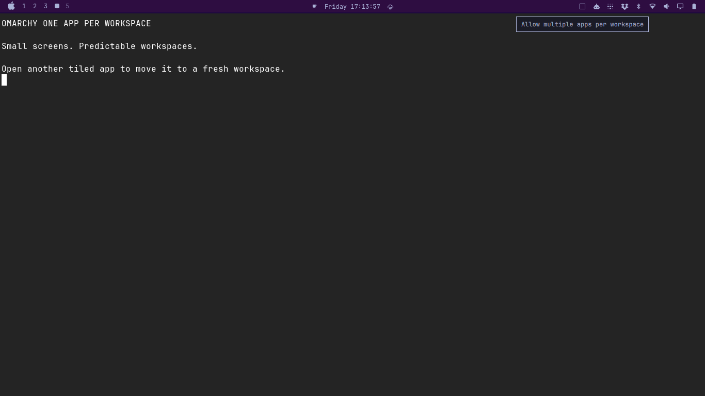
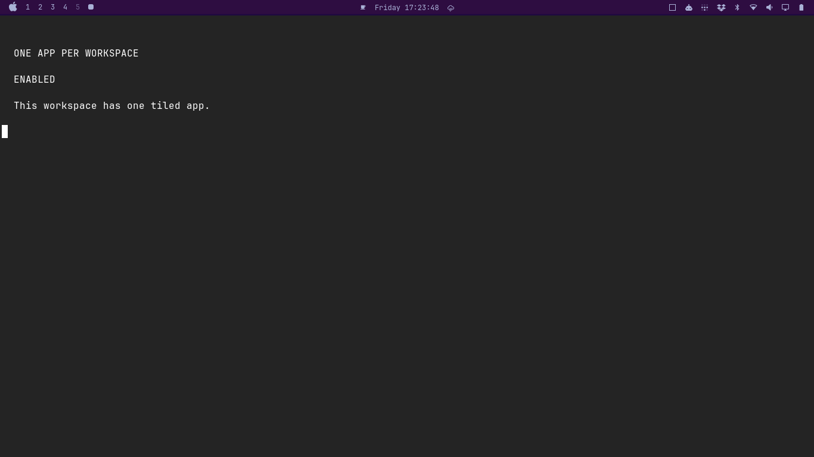
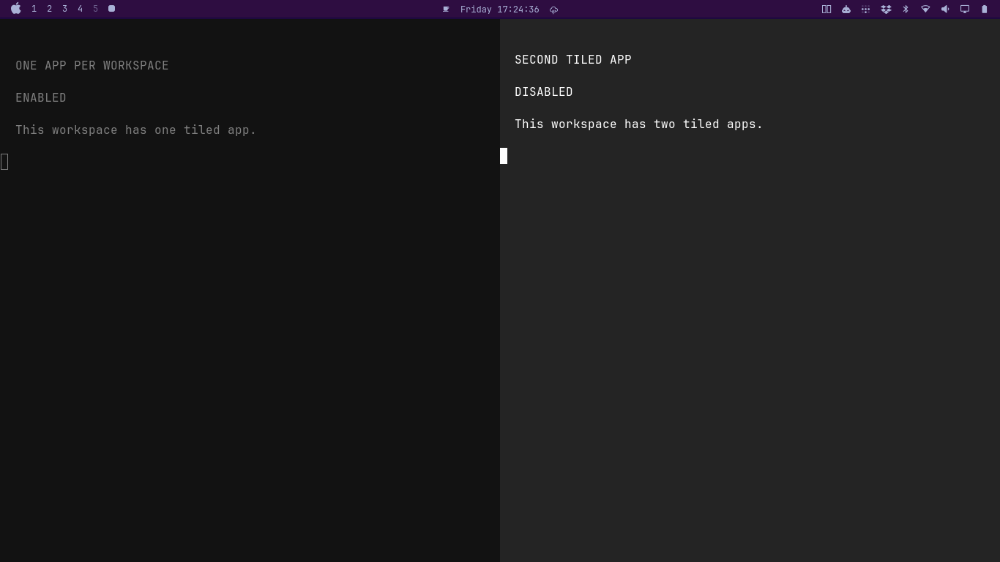

# Omarchy One App Per Workspace

An Omarchy Quickshell plugin that keeps one tiled application on each Hyprland
workspace.



## Why Use It

This is especially useful on small screens, where several tiled applications on
one workspace can make the active window difficult to find. Keeping workspaces
to one app gives workspace switching a predictable result, independent of the
selected tiling layout.

> [!IMPORTANT]
> This plugin is for **Omarchy 4 (Quattro)**, where the desktop shell and bar
> use [Quickshell](https://quickshell.org/). It is not intended for older
> Omarchy releases that use Waybar.

## Behavior

- Starts enabled by default.
- Moves a newly opened tiled window to Hyprland's first empty workspace when
  the focused workspace already contains another window, and follows it there.
- When the focused normal workspace becomes empty after a window closes, focuses
  the nearest occupied workspace before it, then the nearest one after it.
- Falls back to workspace 1 when no occupied workspace is available.
- Does not inspect, change, or depend on the selected Hyprland tiling layout.
- Does not move floating windows when they open.
- On Omarchy's Lua configuration mode, redirects a second tiled window before
  the active layout places it, so Dwindle and Scrolling do not visibly split
  the current workspace first.
- Uses the existing `omarchy-shell` service and a small in-process Hyprland Lua
  hook without a helper daemon or a persistent Hyprland configuration change.

The bar icon is a square while the feature is enabled and two outlined tiles
while it is disabled. Click the icon to toggle the behavior. The setting is
stored in `~/.local/state/omarchy/toggles/one-app-per-workspace-off`, so it is
preserved across shell restarts and reboots. The icon follows the active bar
theme and provides an action-specific tooltip. Toggling from the icon or
hotkey shows a short notification.

## Screenshots





## Requirements

- Omarchy 4 with the Quickshell bar
- Hyprland

## Related Plugin

Users who want consistent floating behavior for selected windows may also find
[`ericvrp.omarchy-floating-window-overrides`](https://github.com/ericvrp/omarchy-floating-window-overrides)
useful alongside this plugin.

## Install

```bash
omarchy plugin add https://github.com/ericvrp/omarchy-one-app-per-workspace.git --enable
```

The plugin manager places the icon in the right bar section by default. Move it
to another section with:

```bash
omarchy bar move ericvrp.one-app-per-workspace --section right
```

An optional keybinding for toggling the feature is:

```text
Super+Ctrl+Alt+O  Toggle one app per workspace
```

## Update

```bash
omarchy plugin update ericvrp.one-app-per-workspace
```

## Disable Or Remove

Disabling the plugin removes its bar icon and stops its workspace handling:

```bash
omarchy plugin disable ericvrp.one-app-per-workspace
```

Remove it completely with:

```bash
omarchy plugin remove ericvrp.one-app-per-workspace
```

The feature toggle state is kept separately from plugin installation.

## Development

Validate the manifest, model tests, and QML imports from the repository root:

```bash
omarchy plugin validate .
./test/one-app-per-workspace-test.sh
qmllint -I "$OMARCHY_PATH/shell" Service.qml
qmllint -I "$OMARCHY_PATH/shell" Widget.qml
```

Install the current working tree as a local plugin build:

```bash
./scripts/dev-install.sh
```

Use `./scripts/dev-install.sh --no-restart` to update the installed files and
bar configuration without restarting the shell. Remove the local build with:

```bash
./scripts/dev-uninstall.sh
```

More development notes are in [DEVELOPING.md](DEVELOPING.md).

## License

Licensed under the [MIT License](LICENSE).
